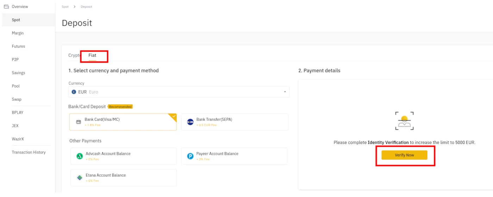

## **Guia facil para empezar a invertir con [nimbusplatform.io](https://app.nimbusplatform.io/ref/5V5T0) y conseguir ingresos diarios**
Esta guia muestra paso a paso como [crear tu cuenta en nimbus platform](https://app.nimbusplatform.io/ref/5V5T0) y como empezar a invertir en cryptomonedas y beneficios dia a dia.

Esta guia contiene las indicaciones basicas de nuestro equipo inversor para nuevos usuarios, ahora publicadas y echas accessibles para todo el mundo.

*[Empieza creando tu cuenta gratuita en nimbus](https://app.nimbusplatform.io/ref/5V5T0)*

## Que es nimbus?

Nimbus es una plataforma de inversion de criptomonedas. Gracias a avanzados bots con Inteligencia Artifical asegura rendibilidad de nuestros depositos y unos retornos de inversion increibles.

A continuación pueden ver de la documentación oficial los beneficios mensuales (asi como el pago por retiro temprano de los dipositos).

Nimbus trabaja en 3 criptomonedas distintas: Bitcoin, Etherum y Tether(USDT). USDT es interesante para usuarios nuevos pues tiene un cambio fijo con el Dollar.

## Como empezar

### Empieza creando tu cuenta en nimbus

Es muy **facil y gratuito**. Simplemente accede al [registro de alta de nimbusplatform.io](https://app.nimbusplatform.io/ref/5V5T0). Puedes usar [este link directo](https://app.nimbusplatform.io/ref/5V5T0)

### Consigue tus criptomonedas

Si aun no tienes cryptomonedas puedes conseguirlas de forma senzila. Puedes hacerlo en muchas plataformas distintas, nosotros recomendamos usar [binance](https://binance.com) por ser senzilla y barata.

1. Crea tu cuenta en Binance. Puedes hacerlo de forma gratuita clicando [aqui](https://accounts.binance.com/es/register)

2. Autentica tu identidad siguiendo los pasos de la plataforma

3. Compra tus primeras criptomonedas siguiendo los pasos del asistente. Recomendamos empezar con Tether USDT. Puedes pagarlos por transferencia, con tarjeta de credito o muchos otros metodos de pago.

A partir de ahora, para esta guia, vamos a asumir que operas con Tether USDT des de binance.

### Mueve tus criptomonedas a nimbus

Before making your first deposit you should place the cryptocurrency in the nimbus platform.
Antes de poder hacer el primer diposito debemos mover las criptomonedas a nimbus, para ello:

1. Ve a tu panel de nimbus y en los totales arriba del todo
2. Selecciona 'Recibir' y en el desplegable selecciona Tether USDT
3. Copia la direccion de tu wallet que aparece como "Su USDT Billetero:". Empieza con 0x...

4. En Binance ve a Billetera -> Billetera Spot y clica a 'Retirar' en la fila de Tether USDT.

5. Pega la dirección de tu wallet de nimbus a la dirección USDT del destinatario.
6. Selecciona la red ERC20 y la cantidad a transferir.

7. Clica a 'Enviar' y espera a recibir tus criptomonedas en nimbus.

### Es el momento! tu primer diposito de criptomonedas

Esto es lo mas facil :)

1. En tu panel de nimbus clica en el segundo icono de la barra lateral 'Mercado'
2. Clicar en 'Instalar' en 'Aplicación Avalon'
3. Selecciona USDT y introduce la cantidad de la que quieres hacer el diposito.

4. Clica siguiente
5. Clica finalizar
6. ... **y espera para ver los beneficios llegando a tu cuenta!**

**Disclaimer**: This page shares a personal experience using this platform and wants to encourage everybody to use it because it has been so beneficial for the ones ho did so. Do it in your own responsibility. What's written here has no warranty and you may reproduce it at your own risk.
**Disclaimer**: Esta pagina comparte una guia personal basada en la experiencia usando esta plataforma y quiere motivar a todo el mundo a usarla por sus altos beneficios. Hazlo bajo exclusivamente tu responsabilidad. Lo que aqui esta escrito no consituie una garantia de ningun tipo. Reproduce estos pasos bajo tu propio riesgo.

Esperamos que la guia os haya sido muy util. Tambión podeis encontrar otros recursos en internet, especialmente en youtube.
